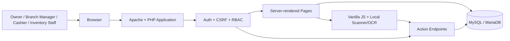
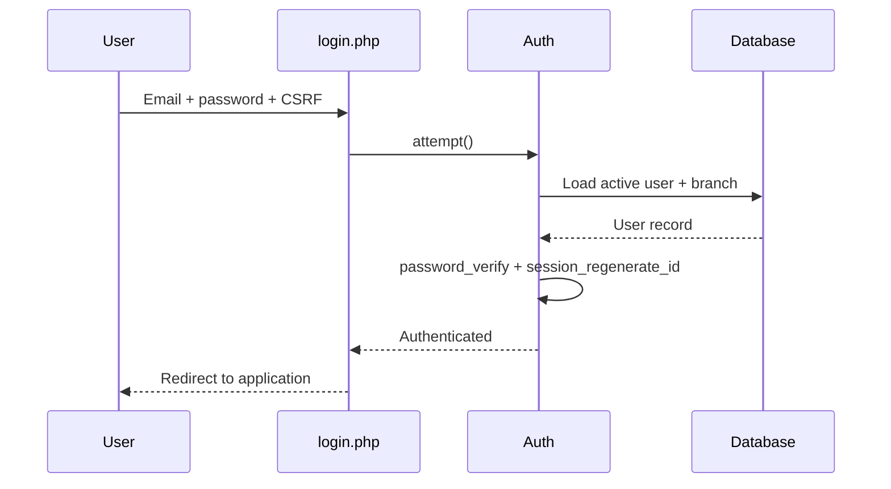
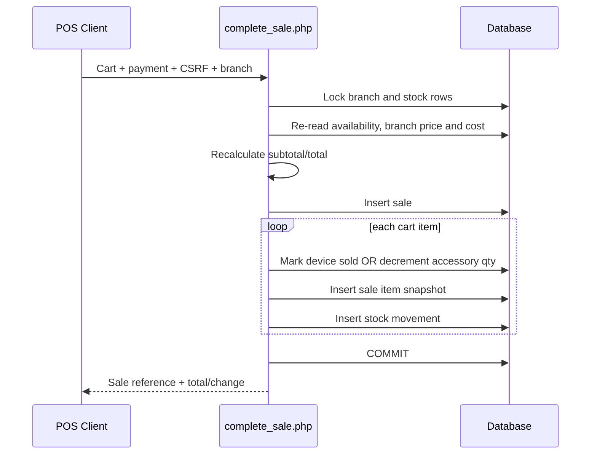

# Malbcoff Trading POS & Inventory System — Architecture

**Document status:** Baseline architecture for continued development  
**Application phase:** Phase 2 in progress  
**Primary stack:** PHP 8+, MySQL/MariaDB, HTML5, CSS3, vanilla JavaScript, PDO  
**Development environment:** XAMPP / Apache / MySQL  
**Application timezone:** `Asia/Manila`

---

## 1. Purpose

This document defines the technical structure that future Malbcoff Trading patches must follow. The goal is to keep POS, inventory, product master, branch pricing, user access, and future modules consistent instead of adding isolated features with conflicting logic.

The current application is a server-rendered PHP system with lightweight JavaScript enhancement. Business rules are enforced primarily on the server, while JavaScript improves search, cart handling, scanning, OCR, dialogs, and form interactions.

---

## 2. Architecture Principles

1. **Server is the source of truth.** Never trust browser-submitted stock, price, availability, role, branch, cost, or totals without re-reading them from the database.
2. **Branch scope is mandatory.** Non-owner users operate only inside their assigned branch.
3. **Serialized and quantity inventory are separate models.** Phones/tablets are tracked per physical unit; accessories are tracked as quantities.
4. **Every stock-changing operation is auditable.** A stock change must create or preserve a corresponding `stock_movements` record.
5. **Financial and stock operations use database transactions.** POS completion, stock receiving, restoration, and adjustments must be atomic.
6. **History must survive catalog cleanup.** Archive/soft-delete is preferred whenever historical inventory or sales reference a product.
7. **No CDN dependency for core operation.** Existing scanner/OCR and UI assets are local so the system remains usable on local networks.
8. **Migrations are explicit.** A code patch that needs a database change must ship with its migration; runtime schema checks are a safeguard, not a migration strategy.

---

## 3. High-Level Architecture



### Request lifecycle

1. `bootstrap.php` loads application config, timezone, session, database, CSRF, authentication, and helpers.
2. `index.php` requires authentication, resolves the requested page, applies page-level access checks, and renders shared layout partials.
3. `pages/*.php` read data and render UI.
4. `actions/*.php` validate authentication, role, CSRF, input, branch scope, and database state before mutation.
5. `Database` uses prepared PDO statements with exceptions enabled and emulated prepares disabled.
6. Mutating flows redirect with flash messages or return JSON for asynchronous actions.

---

## 4. Repository Structure

```text
malbcoff/
├── actions/                 # Server-side mutations and AJAX endpoints
│   ├── add_item.php
│   ├── adjust_inventory.php
│   ├── complete_sale.php
│   ├── pos_search.php
│   ├── product_master.php
│   ├── product_units.php
│   ├── stock_in.php
│   └── variant_inventory.php
├── assets/
│   ├── brand-logos/         # Local brand SVGs
│   ├── css/app.css          # Shared design system and page styles
│   ├── js/                  # UI, POS, IMEI/serial reader, OCR
│   └── vendor/              # Local scanner/OCR dependencies
├── config/
│   ├── app.php
│   └── database.php
├── core/
│   ├── Auth.php
│   ├── Csrf.php
│   ├── Database.php
│   └── helpers.php
├── database/
│   ├── malbcoff_pos.sql     # Base schema currently included
│   └── demo_seed.sql
├── design-reference/        # Approved owner and branch UI references
├── pages/                   # Server-rendered application views
├── partials/                # Header, sidebar, top bar, footer
├── bootstrap.php
├── index.php
├── login.php
└── logout.php
```

### File responsibility rule

- `pages/` must not become the main home of complex write logic.
- `actions/` owns mutations and AJAX writes.
- `core/` contains reusable infrastructure, not page-specific code.
- `helpers.php` may contain small shared presentation/domain helpers; large domain services should move to dedicated classes as the system grows.
- New SQL changes belong in versioned files under `database/migrations/` or an equivalent migration folder.

---

## 5. Roles and Access Architecture

| Capability | Owner | Branch Manager | Inventory Staff | Cashier |
|---|---:|---:|---:|---:|
| Dashboard | All branches / selected branch | Own branch | Own branch | Own branch |
| POS | Yes | Yes | No | Yes |
| Product catalog viewing | Yes | Yes | Yes | Yes unless later restricted |
| Product/variant maintenance | Yes | Branch-limited pricing; current code allows selected maintenance actions | Limited | No |
| Receive stock | Yes | Yes | Yes | No |
| Stock movement history | Yes | Yes | Yes | No |
| Owner inventory adjustment | Yes | No | No | No |
| Branch price management | All branches | Own branch | No | No |
| User list | All branches | Own branch | No | No |
| Cost visibility/control | Yes | Must remain restricted where applicable | No | No |

### Branch scoping

- `Owner`: `branch_id` may be `NULL`; branch selection can be supplied through the owner branch switcher.
- Non-owner: effective branch must always come from `Auth::branchId()`. A submitted `branch_id` must never override the authenticated branch.
- Queries for non-owner users must include branch filtering at the SQL layer, not only in the UI.

---

## 6. Domain Architecture

### 6.1 Product catalog hierarchy

```text
Brand
└── Product Model
    └── Product Variant (`products`)
        ├── Phone / Tablet → serialized physical units (`inventory_units`)
        └── Accessory      → branch quantity (`inventory_balances`)
```

A phone/tablet variant is identified by product type + brand + model + configuration such as RAM, storage, connectivity, and color.

An accessory is identified by its product record/category and may use a barcode for POS lookup.

### 6.2 Device inventory

Phones and tablets are unit-level inventory. Each physical device has a record in `inventory_units` containing its identifiers, condition, branch, acquisition data, and lifecycle status.

Typical lifecycle:

```text
Received → available → sold
                    ↘ defective
                    ↘ returned
                    ↘ adjusted_out
                    ↘ transferred   (future/partial workflow)
```

Rules for IMEI/serial handling are defined in `RULES.md`.

### 6.3 Accessory inventory

Accessories use `inventory_balances`, one quantity per product + branch. Stock in increases quantity; sales decrease quantity atomically.

### 6.4 Branch pricing

The current application supports branch-specific selling prices through `branch_product_prices`, with product-level `selling_price` as fallback. The server resolves price using the active branch.

Cost and branch selling price are distinct:

- Cost is protected business data and should be owner-controlled.
- Selling price may vary by branch.
- POS must resolve current server-side price and never accept a cart price as authoritative.

---

## 7. Core Workflows

### 7.1 Authentication



### 7.2 Receive stock

1. User must be Owner, Branch Manager, or Inventory Staff.
2. Effective branch is resolved by server rules.
3. Product variant is selected or, where allowed, created.
4. Branch selling price is validated; Owner/Branch Manager may update it according to role.
5. Serialized devices validate IMEI/serial uniqueness and device-specific identifier rules.
6. Previously adjusted-out units may be restored only when model/branch rules match.
7. Accessories update branch quantity balances.
8. Each receive operation writes `stock_movements` with a generated stock reference.
9. Database transaction commits only after all validations and writes succeed.

### 7.3 POS sale



Current POS scope:

- Brand-new phones/tablets
- Accessories
- Cash, GCash, Maya, Card, Bank Transfer
- Pre-loved POS is intentionally deferred in current code
- Discounts/promotions are intentionally deferred

### 7.4 Owner inventory adjustment

Only Owner can remove available serialized units through the current adjustment endpoint. Allowed reasons include stock correction, damaged, missing, return to supplier, and other. The operation changes unit status and creates a negative adjustment movement.

### 7.5 Product master

Product master manages brand/model/variant lifecycle. Variants with operational/sold dependencies have restricted spec editing. Archiving requires no available stock. Deletion is physical only when no history exists; otherwise historical products are retained through catalog soft-delete fields.

---

## 8. Security Architecture

### Existing controls

- Passwords use PHP password hashing and `password_verify()`.
- Session ID is regenerated after login.
- Session cookie is HTTP-only and uses `SameSite=Lax`.
- CSRF tokens protect mutating form/API requests.
- PDO prepared statements are used for SQL execution.
- HTML output is escaped via `e()`.
- Role and branch checks exist in action handlers.

### Required security direction

1. Production database credentials must not remain hardcoded in committed source. Use environment/server configuration.
2. Production cookies should enable `Secure` under HTTPS.
3. Add session timeout and, if required, single-active-session controls.
4. Add login throttling/temporary lockout for repeated failures.
5. Record sensitive owner actions in an audit log when user administration, price overrides, transfers, returns, and adjustments expand.
6. Never expose cost/profit data through HTML or JSON to roles without permission.
7. File/image scanning features must validate type/size before processing if upload persistence is added.

---

## 9. Concurrency and Data Integrity

For any operation that can race between users:

- Start a database transaction.
- Select affected stock rows using `FOR UPDATE` where appropriate.
- Revalidate status and branch after locking.
- Use guarded updates, e.g. `... WHERE status='available'` or `quantity >= ?`.
- Check `rowCount()` and fail the transaction when another user changed the row.
- Insert audit/movement records in the same transaction.
- Commit only at the end.

This pattern is already used in POS completion and inventory adjustment and must remain the standard.

---

## 10. Scanner and OCR Architecture

The repository includes local browser-side libraries for barcode/identifier scanning and Tesseract-based OCR. The scanner/OCR layer is an **input aid only**.

- Scanned values must pass the same server-side validation as manually typed values.
- OCR confidence must never automatically bypass duplicate checks.
- The server must normalize identifiers before comparing/storing them.
- Hardware camera/browser permission failures must always have a manual-entry fallback.

---

## 11. Deployment Architecture

### Local / XAMPP

```text
Browser → Apache (XAMPP) → PHP → MySQL/MariaDB
```

The application is designed to run without Node.js or external runtime services.

### Production target

Recommended production layout:

```text
HTTPS Reverse Proxy / Apache
        ↓
PHP application
        ↓
MySQL/MariaDB
        ↓
Automated backups + restricted DB user
```

Production checklist:

- HTTPS enabled
- `display_errors=Off`, errors logged server-side
- Non-root DB user with least privilege
- Environment-specific DB credentials
- Daily database backups and tested restore process
- Migration backup before schema changes
- No demo credentials/data exposed
- `.git` directory not publicly served

---

## 12. Current Schema Drift / Technical Debt

The current ZIP contains application code that expects database changes that are **not present in the included base `database/malbcoff_pos.sql`**. Runtime error messages reference migrations such as P1-004, P1-006, P2-001, P2-004, P2-007, and P2-009, but those migration files are absent from this package.

Current code references at least these extensions:

- `tablet` product type
- `product_models.device_type`
- `products.connectivity`
- `inventory_units.imei2`
- `inventory_units.condition_type`
- `inventory_units.acquisition_cost`
- `inventory_units.selling_price_snapshot`
- `inventory_units.status='adjusted_out'`
- `stock_movements.unit_cost`
- `stock_movements.unit_selling_price`
- `branch_product_prices`
- `sales`
- `sale_items`
- `products.catalog_deleted_at`
- `products.catalog_deleted_by`

**Architecture rule:** before the next feature patch, consolidate these changes into versioned migration files and provide a clean install path that produces the exact schema expected by the current code.

---

## 13. Recommended Future Module Boundaries

As Phase 2 grows, move complex logic from action files into domain services without changing behavior:

```text
core/
services/
├── InventoryService.php
├── ProductCatalogService.php
├── PricingService.php
├── SalesService.php
├── TransferService.php
└── ReportingService.php
```

Future modules should be added in this order unless business priority changes:

1. Schema consolidation/migrations
2. Sales history + receipt/reprint
3. User CRUD and permissions hardening
4. Branch-to-branch transfer
5. Returns/defective workflow
6. Pre-loved POS
7. Discounts/promotions with authorization
8. Reporting and profit analytics
9. Backup/audit administration

---

## 14. Architecture Definition of Done

A patch is architecture-compliant only when:

- Role and branch authorization exists server-side.
- CSRF is enforced on mutations.
- SQL uses prepared statements.
- Stock-changing writes use a transaction where atomicity matters.
- Stock history is recorded.
- Database migration is included for every schema change.
- Existing owner/branch views still function.
- No existing historical sales or inventory are deleted accidentally.
- UI remains consistent with `DESIGN.md`.
- Domain behavior remains consistent with `RULES.md` and `SCHEMA.md`.
