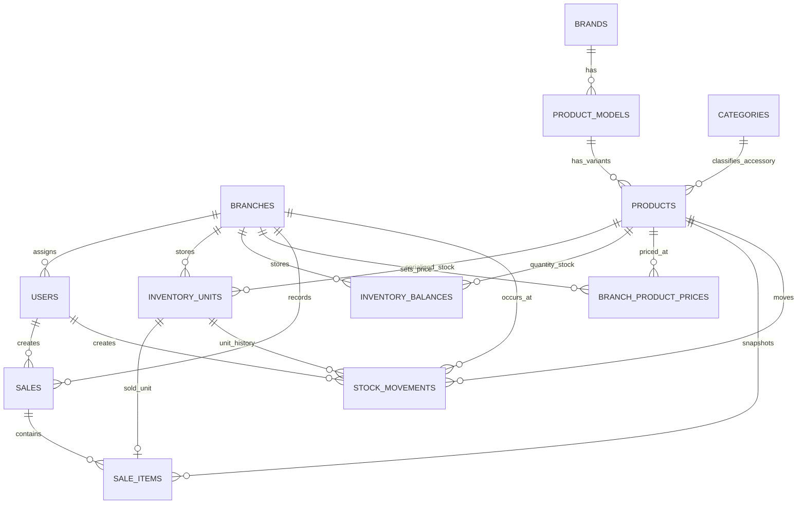

# Malbcoff Trading POS & Inventory System — Database Schema Contract

**Database:** `malbcoff_pos`  
**Engine target:** MySQL/MariaDB with InnoDB  
**Character set:** `utf8mb4`

This document describes the schema the current application conceptually requires. It also records the gap between the included base SQL and columns/tables referenced by the current Phase 2 PHP code.

> Important: the ZIP's `database/malbcoff_pos.sql` is an older base schema. Several Phase 1/Phase 2 migration files referenced by the application are not included. Treat the extended fields below as the target schema contract to consolidate into versioned migrations before deployment.

---

## 1. Entity Relationship Overview

---

## 2. `branches`

Stores retail/business locations.

| Column | Type | Rules |
|---|---|---|
| `id` | INT UNSIGNED | PK, auto increment |
| `name` | VARCHAR(100) | required |
| `code` | VARCHAR(20) | required, unique; used in references |
| `is_active` | TINYINT(1) | default 1 |
| `created_at` | TIMESTAMP | default current timestamp |

Indexes/constraints:

- PK `id`
- UNIQUE `code`

Business rule: inactive branches cannot be selected for new operational transactions.

---

## 3. `users`

Application users and role/branch assignment.

| Column | Type | Rules |
|---|---|---|
| `id` | INT UNSIGNED | PK, auto increment |
| `branch_id` | INT UNSIGNED NULL | FK → `branches.id`; Owner may be NULL |
| `name` | VARCHAR(120) | required |
| `email` | VARCHAR(160) | required, unique |
| `password_hash` | VARCHAR(255) | required |
| `role` | ENUM | `owner`, `branch_manager`, `cashier`, `inventory` |
| `is_active` | TINYINT(1) | default 1 |
| `created_at` | TIMESTAMP | default current timestamp |

Recommended future fields:

- `updated_at`
- `last_login_at`
- audit fields for deactivation/role changes if user administration expands

---

## 4. `brands`

Product brands.

| Column | Type | Rules |
|---|---|---|
| `id` | INT UNSIGNED | PK |
| `name` | VARCHAR(100) | required, unique |
| `is_active` | TINYINT(1) | default 1 |

Current local logos support Apple, Samsung, Xiaomi, Oppo, Vivo, Realme, Redmi, Tecno, Itel, Infinix, Honor, Poco, and Nubia with fallback for other brands.

---

## 5. `product_models`

Models under a brand.

| Column | Type | Source/status | Rules |
|---|---|---|---|
| `id` | INT UNSIGNED | base | PK |
| `brand_id` | INT UNSIGNED | base | FK → `brands.id` |
| `name` | VARCHAR(150) | base | required |
| `device_type` | ENUM/VARCHAR | **required by current code; missing from base SQL** | `phone` or `tablet` |
| `is_active` | TINYINT(1) | base | default 1 |

Constraint:

- UNIQUE (`brand_id`, `name`)

---

## 6. `categories`

Accessory categories.

| Column | Type | Rules |
|---|---|---|
| `id` | INT UNSIGNED | PK |
| `name` | VARCHAR(100) | required, unique |
| `is_active` | TINYINT(1) | default 1 |

---

## 7. `products`

Catalog item/variant table. For devices this represents a model configuration; for accessories it represents the sellable SKU/product.

| Column | Type | Source/status | Notes |
|---|---|---|---|
| `id` | INT UNSIGNED | base | PK |
| `product_type` | ENUM | base + extension | current code expects `phone`, `tablet`, `accessory`; legacy base also contains `preloved` |
| `brand_id` | INT UNSIGNED NULL | base | FK → `brands.id` |
| `model_id` | INT UNSIGNED NULL | base | FK → `product_models.id` |
| `category_id` | INT UNSIGNED NULL | base | FK → `categories.id` |
| `product_name` | VARCHAR(180) NULL | base | primarily accessory name |
| `ram` | VARCHAR(40) NULL | base | device variant |
| `storage` | VARCHAR(40) NULL | base | device variant |
| `connectivity` | VARCHAR(40) NULL | **required by current code; missing from base SQL** | tablet connectivity |
| `color` | VARCHAR(80) NULL | base | device variant |
| `barcode` | VARCHAR(120) NULL | base | accessory/product lookup |
| `cost_price` | DECIMAL(12,2) | base | owner-protected cost baseline |
| `selling_price` | DECIMAL(12,2) | base | fallback/default price |
| `low_stock_threshold` | INT | base | default 5 |
| `is_active` | TINYINT(1) | base | catalog active state |
| `catalog_deleted_at` | DATETIME/TIMESTAMP NULL | **required by current code; missing from base SQL** | soft catalog removal when history exists |
| `catalog_deleted_by` | INT UNSIGNED NULL | **required by current code; missing from base SQL** | user performing catalog removal |
| `created_at` | TIMESTAMP | base | default current timestamp |

Recommended constraints/indexes:

- index on `product_type`
- index on `barcode`
- index on `brand_id`, `model_id`, `is_active`
- index on `catalog_deleted_at`
- logical uniqueness for device variant configuration

Important: `product_type='preloved'` exists in the old base schema, while current code also uses `inventory_units.condition_type='preloved'`. Consolidation should choose one canonical model; current runtime behavior favors condition at unit level for device condition.

---

## 8. `inventory_units`

One row per physical serialized phone/tablet.

| Column | Type | Source/status | Notes |
|---|---|---|---|
| `id` | BIGINT UNSIGNED | base | PK |
| `product_id` | INT UNSIGNED | base | FK → `products.id` |
| `branch_id` | INT UNSIGNED | base | FK → `branches.id` |
| `imei` | VARCHAR(80) NULL/required by type | base | primary IMEI identifier |
| `imei2` | VARCHAR(80) NULL | **required by current code; missing from base SQL** | secondary IMEI |
| `serial_no` | VARCHAR(120) NULL | base | serial identifier |
| `condition_type` | ENUM/VARCHAR | **required by current code; missing from base SQL** | expected `brand_new` / `preloved` |
| `condition_grade` | VARCHAR(30) NULL | base | optional pre-loved grading |
| `battery_health` | TINYINT UNSIGNED NULL | base | 1–100 when relevant |
| `acquisition_cost` | DECIMAL(12,2) | **required by current code; missing from base SQL** | cost snapshot per physical unit |
| `selling_price_snapshot` | DECIMAL(12,2) NULL | **required by current code; missing from base SQL** | receiving-time price snapshot if used |
| `status` | ENUM/VARCHAR | base + extension | `available`, `reserved`, `sold`, `defective`, `transferred`, `returned`, plus `adjusted_out` required by current code |
| `created_by` | INT UNSIGNED | base | FK → `users.id` |
| `created_at` | TIMESTAMP | base | created timestamp |
| `updated_at` | TIMESTAMP | base | auto-update timestamp |

Identifier constraints:

- Base SQL currently declares `imei` UNIQUE and NOT NULL. This conflicts with serial-only Wi-Fi/Apple paths in current code and should be redesigned during schema consolidation.
- Recommended target is nullable identifier columns with unique indexes that permit NULL values, plus application validation ensuring the correct identifier exists for the device type.
- `imei2` should also be unique when not null.
- `serial_no` should be unique when not null.

Indexes:

- (`branch_id`, `status`)
- `product_id`
- identifier indexes/unique keys

---

## 9. `inventory_balances`

Quantity stock for accessories.

| Column | Type | Rules |
|---|---|---|
| `id` | BIGINT UNSIGNED | PK |
| `product_id` | INT UNSIGNED | FK → `products.id` |
| `branch_id` | INT UNSIGNED | FK → `branches.id` |
| `quantity` | INT | default 0; must not become negative |
| `updated_at` | TIMESTAMP | auto-update |

Constraint:

- UNIQUE (`product_id`, `branch_id`)

---

## 10. `branch_product_prices`

**Required by current code but not included in base SQL.** Stores branch-specific selling price.

Logical target:

| Column | Type | Rules |
|---|---|---|
| `id` | BIGINT/INT UNSIGNED | PK, optional if composite key is used |
| `product_id` | INT UNSIGNED | FK → `products.id` |
| `branch_id` | INT UNSIGNED | FK → `branches.id` |
| `selling_price` | DECIMAL(12,2) | required, >= 0 |
| `updated_by` | INT UNSIGNED NULL | FK → `users.id` |
| `created_at` | TIMESTAMP | recommended |
| `updated_at` | TIMESTAMP | current code expects update timestamp behavior |

Required constraint:

- UNIQUE (`product_id`, `branch_id`)

Current helper uses `INSERT ... ON DUPLICATE KEY UPDATE`, so a unique key on product+branch is mandatory.

---

## 11. `stock_movements`

Audit/event history for inventory changes.

| Column | Type | Source/status | Notes |
|---|---|---|---|
| `id` | BIGINT UNSIGNED | base | PK |
| `product_id` | INT UNSIGNED | base | FK → `products.id` |
| `unit_id` | BIGINT UNSIGNED NULL | base | FK → `inventory_units.id` |
| `branch_id` | INT UNSIGNED | base | FK → `branches.id` |
| `movement_type` | ENUM | base | stock/sale/transfer/adjustment/return/defective |
| `quantity` | INT | base | signed movement quantity |
| `reference_no` | VARCHAR(100) NULL | base | business transaction reference |
| `notes` | VARCHAR(255) NULL | base | reason/details |
| `unit_cost` | DECIMAL(12,2) NULL | **required by current code; missing from base SQL** | cost snapshot |
| `unit_selling_price` | DECIMAL(12,2) NULL | **required by current code; missing from base SQL** | selling snapshot |
| `created_by` | INT UNSIGNED | base | FK → `users.id` |
| `created_at` | TIMESTAMP | base | event timestamp |

Indexes:

- (`branch_id`, `created_at`)
- `movement_type`
- `product_id`
- `unit_id`
- `reference_no` recommended

Quantity convention:

- positive = stock enters
- negative = stock leaves

---

## 12. `sales`

**Required by current POS code but absent from base SQL.** Header record for a completed sale.

Columns inferred directly from current insert/query usage:

| Column | Type | Rules |
|---|---|---|
| `id` | BIGINT UNSIGNED | PK, auto increment |
| `sale_no` | VARCHAR(100) | required, unique |
| `branch_id` | INT UNSIGNED | FK → `branches.id` |
| `subtotal` | DECIMAL(12,2) | required |
| `total` | DECIMAL(12,2) | required |
| `payment_method` | ENUM/VARCHAR | `cash`, `gcash`, `maya`, `card`, `bank_transfer` |
| `payment_reference` | VARCHAR(120) NULL | optional non-cash reference |
| `amount_received` | DECIMAL(12,2) NULL | cash only |
| `change_due` | DECIMAL(12,2) | default 0 |
| `status` | ENUM/VARCHAR | current code inserts `completed` |
| `created_by` | INT UNSIGNED | FK → `users.id` |
| `created_at` | TIMESTAMP | required for recent sales/history |

Recommended indexes:

- UNIQUE `sale_no`
- (`branch_id`, `created_at`)
- (`created_by`, `created_at`)
- `status`

Future-safe statuses may include `completed`, `voided`, `refunded`, `partially_refunded`, but these must not be added to behavior until a formal workflow exists.

---

## 13. `sale_items`

**Required by current POS code but absent from base SQL.** Immutable sale line snapshots.

Columns inferred directly from current insert/query usage:

| Column | Type | Rules |
|---|---|---|
| `id` | BIGINT UNSIGNED | PK |
| `sale_id` | BIGINT UNSIGNED | FK → `sales.id` |
| `product_id` | INT UNSIGNED | FK → `products.id` |
| `unit_id` | BIGINT UNSIGNED NULL | FK → `inventory_units.id`; device line only |
| `item_name_snapshot` | VARCHAR(255) | item name at sale time |
| `specs_snapshot` | VARCHAR(255) NULL | configuration/category at sale time |
| `identifier_snapshot` | VARCHAR(255) NULL | IMEI/serial/barcode text at sale time |
| `quantity` | INT | device = 1; accessory >= 1 |
| `unit_cost` | DECIMAL(12,2) | cost snapshot |
| `unit_price` | DECIMAL(12,2) | selling price snapshot |
| `line_total` | DECIMAL(12,2) | quantity × unit price |
| `created_at` | TIMESTAMP | recommended/default current timestamp |

Indexes:

- `sale_id`
- `product_id`
- `unit_id`

Historical rule: snapshots must never be recomputed from the live product catalog for a receipt or historical report.

---

## 14. Recommended Future `audit_logs`

Not currently implemented in the inspected package, but recommended when administration expands.

Suggested fields:

| Column | Type | Purpose |
|---|---|---|
| `id` | BIGINT | PK |
| `user_id` | INT | actor |
| `branch_id` | INT NULL | scope |
| `action` | VARCHAR(100) | e.g. `price.updated` |
| `entity_type` | VARCHAR(80) | product/user/sale/etc. |
| `entity_id` | VARCHAR(80) NULL | target |
| `reference_no` | VARCHAR(100) NULL | business ref |
| `before_json` | JSON/TEXT NULL | safe previous state |
| `after_json` | JSON/TEXT NULL | safe new state |
| `ip_address` | VARCHAR(45) NULL | optional |
| `created_at` | TIMESTAMP | timestamp |

Do not store passwords or highly sensitive secrets in audit JSON.

---

## 15. Relationship Rules

- One branch has many users, units, balances, prices, sales, and movements.
- One brand has many models.
- One model has many device variants.
- One product has many serialized units OR branch balances depending on type.
- One sale has many sale items.
- One serialized unit may appear in at most one completed original sale unless future returns/resales are explicitly modeled.
- Stock movements are append-style history and should not be deleted during normal operations.

---

## 16. Indexing Requirements

At minimum, preserve/add indexes for:

- `users.email`
- `branches.code`
- `products.barcode`
- `products(product_type, is_active)`
- `products(brand_id, model_id)`
- serialized identifiers: `imei`, `imei2`, `serial_no`
- `inventory_units(branch_id, status)`
- `inventory_units(product_id, branch_id, status)`
- `inventory_balances(product_id, branch_id)` unique
- `branch_product_prices(product_id, branch_id)` unique
- `stock_movements(branch_id, created_at)`
- `stock_movements(reference_no)`
- `sales.sale_no` unique
- `sales(branch_id, created_at)`
- `sale_items.sale_id`

---

## 17. Currency and Quantity Rules

- Monetary database fields: `DECIMAL(12,2)` unless larger range is required.
- PHP may convert to float for display/current legacy calculations, but persisted monetary arithmetic should remain consistently rounded to 2 decimals.
- Serialized unit count is derived from rows/status.
- Accessory quantity is integer balance.
- Quantity must never become negative.

---

## 18. Delete and Foreign-Key Policy

Default rule: **do not cascade-delete historical business data.**

Recommended behavior:

- User deactivation instead of deleting users referenced by transactions.
- Product archive/soft-delete instead of deleting products with history.
- Branch deactivation instead of deletion after transactions exist.
- Sales and stock movements are historical records and should not be physically deleted in normal operations.

---

## 19. Migration Consolidation Plan

The next database-maintenance patch should:

1. Keep `database/malbcoff_pos.sql` as a reproducible clean-install schema or replace it with documented migration bootstrap.
2. Create a `database/migrations/` folder.
3. Reconstruct and include all currently required missing Phase 1/Phase 2 migrations.
4. Resolve the `products.product_type='preloved'` versus `inventory_units.condition_type='preloved'` overlap.
5. Resolve nullable/unique IMEI requirements for serial-only devices.
6. Add `branch_product_prices`, `sales`, and `sale_items` with constraints.
7. Add all fields referenced by current PHP.
8. Test both:
   - clean database install
   - upgrade from the current base schema with existing data
9. Update this file with exact migration names and final SQL types once consolidated.

---

## 20. Schema Definition of Done

A database change is complete when:

- Migration is included in the repository.
- Existing data is preserved or deliberately migrated.
- Required indexes and foreign keys exist.
- Application code does not reference missing fields.
- Clean install succeeds.
- Upgrade succeeds.
- POS and stock receive transactions pass end-to-end tests.
- `SCHEMA.md` reflects the actual resulting schema.
